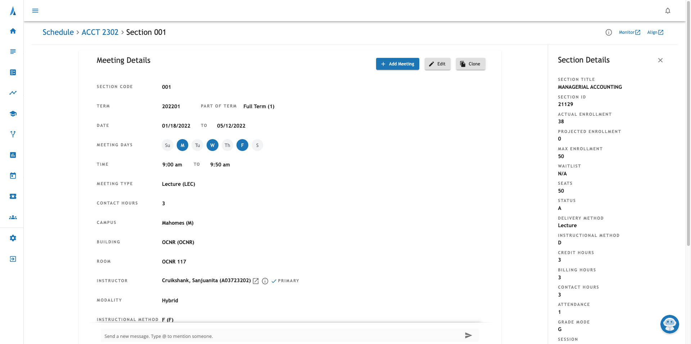

# {frontmatter.title}

## 🕵️‍♂️ Background

I'm a software engineer at [Ad Astra](https://www.aais.com/) - a higher education SaaS company focused on course scheduling & student success that services 500+ mascots around the country. We are hiring for [several positions](https://www.aais.com/careers). We got some feedback that our current section details page was confusing and too busy with fields they didn't care as much about.

## 🏆 Our Goal

- Optimize the section details page for departments by displaying section data at the top level with all related meetings visible without switching pages. 
- Highlight important fields & hide less-important fields below the "fold" with the ability to reveal those fields if needed.



The old view only displays one section meeting (child) at a time & the section details (parent) were displayed in a drawer & many users found this positioning to be confusing.


Here is the final product after the redesign. It's much easier to edit multiple meetings and see the fields you care about at a glance.

## 😬 The "Deadline"

Our Engineering team typically tries to avoid having [deadlines](https://geoff-vandegrift.medium.com/embracing-the-journey-6c84c1828609). We aspire to get customer feedback on a story within 2 weeks of building and we "estimate" when our stories will be done. These estimates fluctuate with any new information we gather throughout the building process.

Things were a little different for this redesign because we had some pressure to implement the redesign in time for one of our mascots to begin onboarding.
The mascot wanted to go live sooner than we had thought, which left us with 4 weeks to do the overhaul.


## 🚫 Testing

Early on in the overhaul, a large number of the original tests failed due to the structure of the app changing, not so much the functionality changing. With the pending deadline and fear of maintaining the tests during the refactor, we ignored coverage & tests for the redesigned page (NewSectionDetails) until we had more of the functionality implemented.


## 🐛 A Swarm of Bugs

Naturally we introduced a lot of bugs when introducing multiple meetings to the section details page. The complexity of the refactor had become worse than we had originally anticipated.

### How It Started 😁

The number of bugs we introduced far exceeded all of our expectations. To keep track of all the bugs to go fix later, we started adding checklist items to our stories.


### How It's Going 🤬

As the list of bugs we found grew, we ran out of allowed checklist items on out two stories. We had to create a "Bug Pack" to record all the bugs we found.


And another one...


## 💀 Death Spiral

Remember when we ignored the tests? We were constantly deploying bug fixes without tests & other teams were starting to dip their toe into the redesigned page (NewSectionDetails).

All hell broke loose as the deadline drew closer 🔥.

Some common phrases I started hearing:

```
"Adding a new section meeting is broken again"

"I swear I just fixed that"

"Just fixed the meeting values being overwritten, now the section values are being overwritten"
```

Since we didn't have `automated testing`, we were constantly `breaking functionality` & `reverting bug fixes`.


~ Shared with me by our CTO

## 🙏🏻 Our Savior QE

Our QE noticed the "death spiral" & began filling the role of our automated tests by manually running through 90+ test cases for each Pull Request. With 5 developers, he was running through this enormous test suite around 2-5 times each day for 2-3 weeks! 🥵 Most of us had a couple late nights, but our QE was working extra hours everyday to keep up with the manual tests.


## 📝 Takeaways

- Deploying to production without tests is nonnegotiable (even in a deadline situation)
- Proper designing & planning should always be done in discovery (Don't just fly by the seat of your pants because you have a deadline)
- Bubble up deadline concerns to management (Don't let them die within the team)
- A deadline can push your team to get shit done quickly ⚡️

## 🔮 The Future

We just finished fixing the tests for the new sections page (NewSectionDetails) and we are working on adding tests for any new functionality. We've got an extra story to go back through & refactor our code to be more stable.


